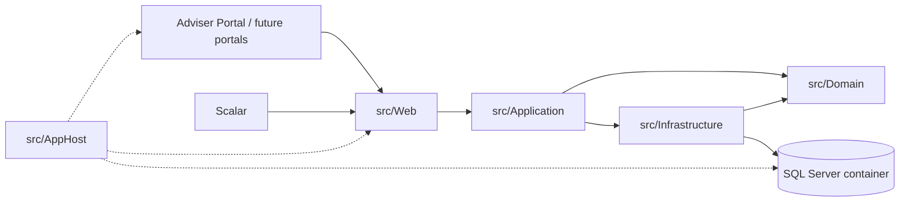
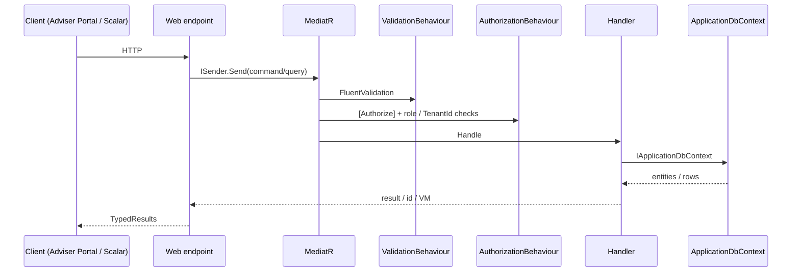

# Architecture

How MyWealth is put together. Update this when a layer, host, or cross-cutting behaviour changes.

This is a light-touch document. Most of the structure is already fixed by the Clean Architecture + Aspire layout. Update only when the frontend hosting model, portal split, or a cross-cutting concern changes.

AuthN for the API is **JWT Bearer**. ASP.NET Identity stores users and hashes passwords; custom endpoints issue and consume JWTs. The template’s `MapIdentityApi` / `AddBearerToken` surface is not used.

## 1. Style

Clean Architecture + CQRS (via MediatR), hosted by .NET Aspire.



Rules that should stay true:

- `Domain` has no project references.
- `Application` depends only on `Domain` (plus abstractions it owns).
- `Infrastructure` implements Application interfaces (`IApplicationDbContext`, `IIdentityService`, etc.).
- `Web` is a composition root: endpoints dispatch MediatR requests. No business rules here.
- New write/read use cases are scaffolded with `dotnet new ca-usecase` from `src/Application`.

The frontend is an independent React application (React + Redux Toolkit + TypeScript + Vite + Tailwind CSS) that talks to the backend only via JWT-protected REST APIs.

Frontend is planned as a multi-portal architecture:

- **Adviser Portal** — MVP scope, must be implemented
- Customer Portal — future, optional
- Back Office — future, optional

Therefore frontend-related Aspire resources and project names **must not** use generic names such as `Frontend` or `Web`. They must clearly indicate the specific portal.

MVP only implements and hosts the **Adviser Portal** inside Aspire.

## 2. Solution map

| Project | Path (planned) | Responsibility |
| --- | --- | --- |
| AppHost | `src/AppHost` | Aspire graph: SQL Server container, `MyWealthDb`, Web API, Adviser Portal, later ACA environment |
| Web | `src/Web` | Minimal API endpoint groups, OpenAPI / Scalar, CORS, backend composition root |
| Application | `src/Application` | Commands, queries, FluentValidation, pipeline behaviours, DTOs |
| Domain | `src/Domain` | Entities, value objects (including Money), domain events, enums, exceptions |
| Infrastructure | `src/Infrastructure` | EF Core, Identity, interceptors, database initialiser |
| Shared | `src/Shared` | Aspire resource name constants |
| ServiceDefaults | `src/ServiceDefaults` | Health checks, OpenTelemetry, service discovery |
| AdviserPortal | (planned, independent frontend project) | React + Redux Toolkit + TypeScript + Vite + Tailwind — the only frontend in MVP |
| Tests | `tests/*` | Domain unit, Application unit, Infrastructure integration, Application functional |

Aspire resource naming convention:

- Backend API: `webapi`
- MVP frontend: `adviser-portal` (or an equally explicit name — never `webfrontend` / `frontend`)
- Reserved for later: `customer-portal`, `back-office`, etc.

Record an ADR before adding any additional portal to the Aspire host.

## 3. Request path



Pipeline order (from `Application/DependencyInjection.cs`):

1. `LoggingBehaviour` (pre-processor)
2. `UnhandledExceptionBehaviour`
3. `AuthorizationBehaviour`
4. `ValidationBehaviour`
5. `PerformanceBehaviour`
6. Handler

EF interceptors on save:

- `AuditableEntityInterceptor` — fills `BaseAuditableEntity` fields
- `DispatchDomainEventsInterceptor` — publishes `BaseEvent`s after save

## 4. Runtime (local)

```bash
dotnet run --project src/AppHost
```

| Resource | Name | Notes |
| --- | --- | --- |
| SQL Server container | `dbserver` | `RunAsContainer` + persistent lifetime |
| Database | `MyWealthDb` | Connection string name matches `Services.Database` |
| Web API | `webapi` | External HTTP, Scalar at `/scalar` |
| Adviser Portal | `adviser-portal` | React (Vite) frontend hosted by Aspire (MVP) |
| ACA environment | `aca-env` | Declared for later Azure Container Apps publish |

**Database lifecycle and seeding**

- In Development the current temporary behaviour may still be `EnsureDeleted` / `EnsureCreated`.
- **Seeding strategy (initial plan)**:
  - Most business data (Tenants, Accounts, Holdings, Transactions, reference data, etc.) → direct SQL scripts.
  - Login accounts and passwords (ASP.NET Identity users) → created in backend code via `UserManager`.  
    Reason: passwords must be hashed by Identity’s PasswordHasher; inserting raw hashes via SQL is error-prone and frequently causes login failures.
- The timing of switching to EF Core Migrations will be decided during development.
- Until real business data exists, local data is considered disposable. See also [database design](database-design.md).

## 5. Cross-cutting concerns

| Concern | Current choice | Where it lives |
| --- | --- | --- |
| AuthN | Email + password + JWT Bearer (ASP.NET Identity for users/passwords; custom `/auth` + `/users/me`, not MapIdentityApi) | `Infrastructure/Identity`, `Web/Endpoints` |
| AuthZ | `[Authorize]` + `AuthorizationBehaviour` + role / TenantId checks | `Application/Common/Security` |
| Multi-tenancy | Shared database + row-level `TenantId` + EF global query filters | Domain entities + Infrastructure filters |
| Money | `Money` value object (`decimal` amount + currency) | Domain + EF owned type |
| Primary key | `int` Identity (`BaseEntity`) | Domain + EF configuration |
| Validation | FluentValidation per command/query | next to each use case |
| Mapping | AutoMapper | Application assembly |
| Errors | `ValidationException`, `NotFoundException`, `ForbiddenAccessException`, exception handler | Application + Web |
| Observability | Aspire / OpenTelemetry service defaults | `ServiceDefaults` |
| API docs | OpenAPI + Scalar | `Web/Program.cs` |
| CORS | Allow any origin / header / method (development) | `Web/Program.cs` — **do not tighten until after MVP features are complete** |
| Secrets | `AddKeyVaultIfConfigured()` | Web |

## 6. Testing layout

| Project | Kind | Use for |
| --- | --- | --- |
| `Domain.UnitTests` | Unit | Value objects, entity invariants |
| `Application.UnitTests` | Unit | Mapping, pure application helpers |
| `Infrastructure.IntegrationTests` | Integration | EF / Identity against a real DB |
| `Application.FunctionalTests` | Functional | HTTP + MediatR against TestAppHost |

A new feature spec should list which of these it will add tests to.

## 7. Decisions to record as ADRs

Create an ADR when you change any of the following. Current defaults and their ADRs:

| Topic | Current default | ADR |
| --- | --- | --- |
| Overall architecture | Aspire + Clean Architecture | [0001](adr/0001-use-dotnet-aspire-and-clean-architecture.md) |
| Database | MSSQL managed by Aspire | [0002](adr/0002-use-mssql-with-aspire.md) |
| Frontend stack | React + Redux Toolkit + TypeScript + Vite + Tailwind | [0003](adr/0003-react-redux-typescript-vite-tailwind-frontend.md) |
| Money representation | `decimal` + Currency (`Money` value object) | [0004](adr/0004-money-as-decimal-with-currency.md) |
| Multi-tenancy | Shared database + row-level `TenantId` | [0005](adr/0005-shared-database-tenantid-isolation.md) |
| Authentication | Email/password + JWT | [0006](adr/0006-email-password-jwt-authentication.md) |
| Primary key | `int` Identity | [0007](adr/0007-baseentity-primary-key-int.md) |
| Frontend portal strategy | Multi-portal plan; MVP only Adviser Portal, hosted in Aspire | Recorded in this document (or future ADR) |
| DB lifecycle / seeding | Most business data via direct SQL; Identity users (incl. passwords) via backend `UserManager`; Migrations timing decided during development | Discussed during development |
| CORS production config | Deferred until after MVP | After MVP |

## 8. Changelog

| Date | Change |
| --- | --- |
| 2026-08-16 | Template created from the current starter snapshot |
| 2026-08-20 | Light-touch update based on accepted ADRs 0001–0007 |
| 2026-08-20 | Confirmed: frontend hosted in Aspire; MVP only Adviser Portal; forbid generic Frontend/Web names |
| 2026-08-22 | Tenants slice: first Domain aggregate; `IApplicationDbContext.Tenants`; `/tenants` endpoints. Migrations still deferred. |
| 2026-08-21 | Identity-auth slice: JwtBearer, custom `/auth` and `/users/me`, Todo/Weather sample removed |
| 2026-08-20 | Seeding strategy clarified: most business data via direct SQL, Identity users + passwords via `UserManager` in backend; CORS production config deferred until after MVP |
