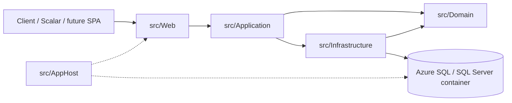
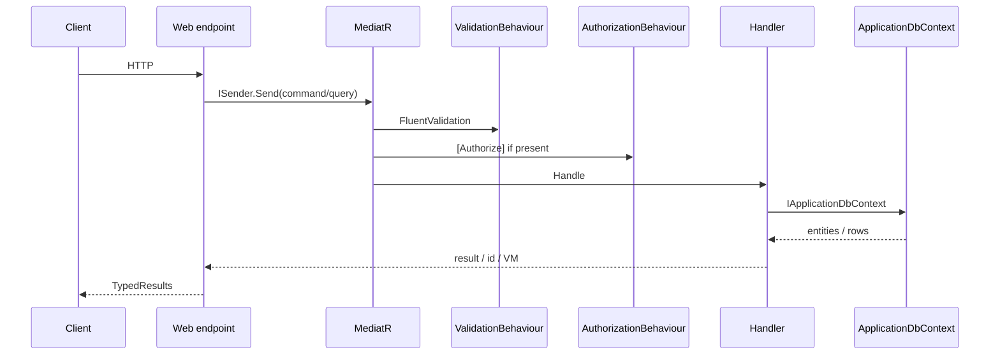

# Architecture

How MyWealth is put together. Update this when a layer, host, or cross-cutting behaviour changes.

## 1. Style

Clean Architecture + CQRS, hosted by .NET Aspire.

Rules that should stay true:

- `Domain` has no project references.
- `Application` depends only on `Domain` (plus abstractions it owns).
- `Infrastructure` implements Application interfaces (`IApplicationDbContext`, `IIdentityService`).
- `Web` is a composition root: endpoints dispatch MediatR requests. No business rules here.
- New write/read use cases are scaffolded with `dotnet new ca-usecase` from `src/Application`.

## 2. Solution map

| Project | Path | Responsibility |
| --- | --- | --- |
| AppHost | `src/AppHost` | Aspire graph: SQL Server + `MyWealthDb`, Web API, ACA environment |
| Web | `src/Web` | Minimal API endpoint groups, OpenAPI / Scalar, CORS, static files |
| Application | `src/Application` | Commands, queries, validators, pipeline behaviours, DTOs |
| Domain | `src/Domain` | Entities, value objects, domain events, enums, exceptions |
| Infrastructure | `src/Infrastructure` | EF Core, Identity, interceptors, initialiser |
| Shared | `src/Shared` | Aspire resource name constants |
| ServiceDefaults | `src/ServiceDefaults` | Health checks, OTel, service discovery |
| Tests | `tests/*` | Domain unit, Application unit, Infrastructure integration, Application functional |

Reserved but unused Aspire name: `Services.WebFrontend` (`webfrontend`). Record an ADR before adding a frontend host.

## 3. Request path

Pipeline order (from `Application/DependencyInjection.cs`):

1. `LoggingBehaviour` (pre-processor)
2. `UnhandledExceptionBehaviour`
3. `AuthorizationBehaviour`
4. `ValidationBehaviour`
5. `PerformanceBehaviour`
6. Handler

EF interceptors on save:

- `AuditableEntityInterceptor` — fills `BaseAuditableEntity` fields
- `DispatchDomainEventsInterceptor` — publishes `BaseEvent`s after save

## 4. Runtime (local)

`dotnet run --project src/AppHost`

| Resource | Name | Notes |
| --- | --- | --- |
| Azure SQL (container locally) | `dbserver` | `RunAsContainer` + persistent lifetime |
| Database | `MyWealthDb` | Connection string name matches `Services.Database` |
| Web API | `webapi` | External HTTP, Scalar at `/scalar` |
| ACA environment | `aca-env` | Declared for later Azure Container Apps publish |

In Development, `Web` calls `InitialiseDatabaseAsync()` which currently **drops and recreates** the database. That is not acceptable once real data exists — see [database design](database-design.md).

## 5. Cross-cutting concerns

| Concern | Current choice | Where it lives |
| --- | --- | --- |
| AuthN | ASP.NET Identity + bearer tokens | `Infrastructure/Identity`, `Web/Endpoints/Users.cs` |
| AuthZ | `[Authorize]` on requests + `AuthorizationBehaviour` | `Application/Common/Security` |
| Validation | FluentValidation per command/query | next to each use case |
| Mapping | AutoMapper | Application assembly |
| Errors | `ValidationException`, `ForbiddenAccessException`, exception handler | Application + Web |
| Observability | Aspire / OpenTelemetry service defaults | `ServiceDefaults` |
| API docs | OpenAPI + Scalar | `Web/Program.cs` |
| CORS | Allow any origin / header / method | `Web/Program.cs` — tighten before production |
| Secrets | `AddKeyVaultIfConfigured()` | Web |

## 6. Testing layout

| Project | Kind | Use for |
| --- | --- | --- |
| `Domain.UnitTests` | Unit | Value objects, entity invariants |
| `Application.UnitTests` | Unit | Mapping, pure application helpers |
| `Infrastructure.IntegrationTests` | Integration | EF / Identity against a real DB (sparse today) |
| `Application.FunctionalTests` | Functional | HTTP + MediatR against TestAppHost |

A new feature spec should list which of these it will add tests to.

## 7. Decisions to record as ADRs

Create an ADR when you change any of the following. Until then, the current default is listed.

| Topic | Current default | ADR |
| --- | --- | --- |
| Persistence | EF Core 10 + SQL Server | |
| Identity | ASP.NET Identity, bearer scheme | |
| Hosting | Aspire 13, Azure Container Apps target | |
| Frontend | None yet (Scalar + `wwwroot`) | |
| Money type | _TBD_ | |
| Multi-tenancy | Single user owns rows | |
| DB lifecycle | `EnsureCreated` in Development | |

## 8. Changelog

| Date | Change |
| --- | --- |
| 2026-08-16 | Template created from the current starter snapshot |
