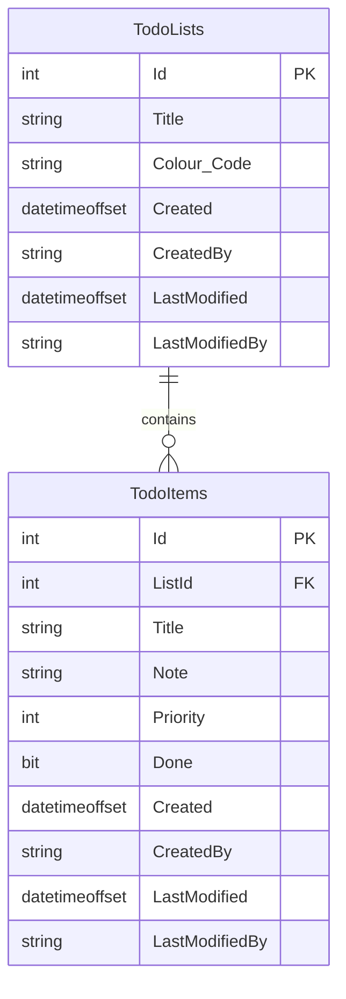
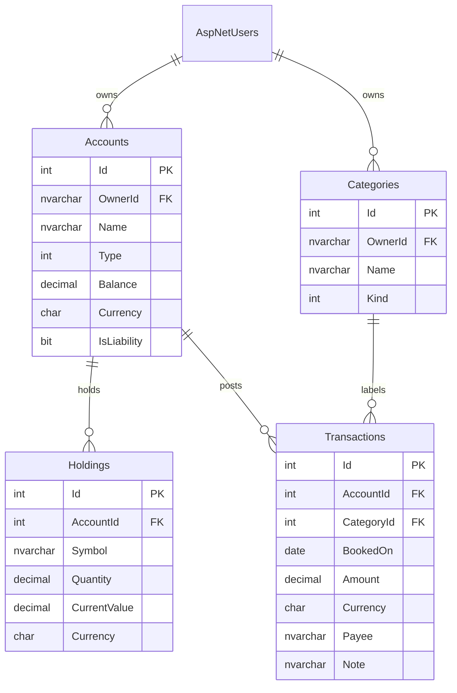

# Database design

Physical model for `MyWealthDb`. Conceptual types stay in [domain-model.md](domain-model.md). This file owns tables, keys, indexes, and migrations.

## 1. Platform

| Item | Choice |
| --- | --- |
| Engine | SQL Server (Aspire `AddAzureSqlServer("dbserver").RunAsContainer(...)`) |
| Database name | `MyWealthDb` (`Services.Database`) |
| Access | EF Core 10, `UseSqlServer` |
| Context | `ApplicationDbContext` : `IdentityDbContext<ApplicationUser>` |
| Configurations | `Infrastructure/Data/Configurations/*` via `ApplyConfigurationsFromAssembly` |
| Naming | EF Core defaults today (Pascal-case tables matching CLR types). Change only with an ADR. |

Connection string is injected by Aspire under the name `MyWealthDb`.

## 2. Lifecycle (important)

Development initialiser (`ApplicationDbContextInitialiser.InitialiseAsync`):

```text
EnsureDeletedAsync()
EnsureCreatedAsync()
SeedAsync()
```

That **wipes the database on every API start** in Development. Fine for the Todo sample. Not fine once MyWealth data is real.

Planned switch (tick when done):

- [ ] Add EF Core migrations project usage (`dotnet ef migrations add`)
- [ ] Replace `EnsureDeleted` / `EnsureCreated` with `MigrateAsync` (or apply migrations from AppHost)
- [ ] Keep seed data idempotent and behind a Development-only flag
- [ ] Document how to reset a local DB without dropping production-shaped data accidentally

Until then, assume local data is disposable.

## 3. Conventions

Apply to every new table unless a feature spec overrides them.

| Topic | Convention |
| --- | --- |
| Primary key | `Id int` identity (matches `BaseEntity`) |
| Ownership | `OwnerId nvarchar` (Identity user id) on every user-owned table, indexed |
| Audit | `Created`, `CreatedBy`, `LastModified`, `LastModifiedBy` via `BaseAuditableEntity` + `AuditableEntityInterceptor` |
| Required strings | `.IsRequired()` + `.HasMaxLength(n)` in `IEntityTypeConfiguration<T>` |
| Money | `decimal(18,2)` (or `decimal(18,4)` for quantities / FX) — never `float` |
| Currency | `char(3)` ISO 4217 |
| Soft delete | Only if the feature spec says so; then `IsDeleted bit` + filtered index |
| Identity tables | Leave ASP.NET Identity schema as-is |
| Value objects | Prefer owned types (see `TodoList.Colour`) unless the VO is reused widely |

Each new entity needs a configuration class in `src/Infrastructure/Data/Configurations/`.

## 4. Current schema (starter)

Plus the usual ASP.NET Identity tables (`AspNetUsers`, `AspNetRoles`, …).



| Table | Configuration | Notes |
| --- | --- | --- |
| `TodoLists` | `TodoListConfiguration` | `Title` required, max 200; `Colour` owned |
| `TodoItems` | `TodoItemConfiguration` | `Title` required, max 200; FK `ListId` |
| Identity | convention | `ApplicationUser` has no extra columns yet |

Seed (Development): administrator user + one "Tasks" list.

## 5. Target schema (fill in)

Example starting point for a wealth app. Delete tables you are not building. Add a row to the catalog **and** a mermaid fragment when a table is accepted.



### Table catalog

| Table | Aggregate | PK | FKs | Unique / indexes | Notes |
| --- | --- | --- | --- | --- | --- |
| | | | | | |

### Column template

Use this when specifying a new table in a feature spec or here.

| Column | Type | Null | Default | Notes |
| --- | --- | --- | --- | --- |
| Id | int identity | no | | PK |
| OwnerId | nvarchar(450) | no | | index, Identity user id |
| Created | datetimeoffset | no | interceptor | |
| CreatedBy | nvarchar | yes | interceptor | |
| LastModified | datetimeoffset | no | interceptor | |
| LastModifiedBy | nvarchar | yes | interceptor | |

## 6. Index and constraint checklist

For each user-owned table:

- [ ] Composite or single index on `OwnerId` (every query is scoped)
- [ ] Unique `(OwnerId, Name)` where names must not collide per user
- [ ] FK `ON DELETE` behaviour written down (restrict vs cascade)
- [ ] Check constraints for money sign / account type if the domain cannot be the only guard

## 7. Seed and reference data

| Data | When | Where |
| --- | --- | --- |
| `Administrator` role | Development seed today | `ApplicationDbContextInitialiser` |
| `administrator@localhost` | Development seed today | same |
| Default categories | _TBD_ | |
| Currency list | _TBD — or just free-form ISO codes_ | |

Do not seed another user's financial data.

## 8. `IApplicationDbContext`

Keep the interface in Application in sync with the context:

```csharp
// src/Application/Common/Interfaces/IApplicationDbContext.cs
DbSet<T> Xs { get; }
Task<int> SaveChangesAsync(CancellationToken cancellationToken);
```

Add a `DbSet<>` for each new aggregate root (not necessarily for every child entity).

## 9. Open questions

- Migrations starting in Phase 0 or with the first real aggregate?
- Schema name (`dbo` vs `wealth`, `identity`)?
- Snapshot table for net-worth history, or compute on read?
- How to store attachments / statement files if import lands?

## 10. Changelog

| Date | Change |
| --- | --- |
| 2026-08-16 | Template created; starter Todo + Identity schema documented |
