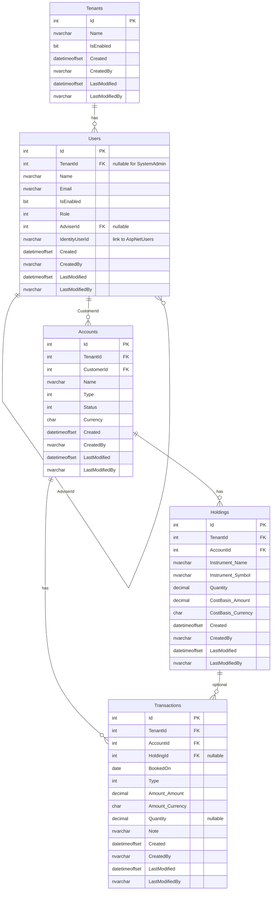

# Database design

Physical model for `MyWealthDb`. Conceptual types stay in [domain-model.md](domain-model.md). This file owns tables, keys, indexes, constraints, and migration notes.

## 1. Platform

| Item | Choice |
| --- | --- |
| Engine | SQL Server (Aspire `AddAzureSqlServer("dbserver").RunAsContainer(...)`) |
| Database name | `MyWealthDb` |
| Access | EF Core 10, `UseSqlServer` |
| Context | `ApplicationDbContext` : `IdentityDbContext<ApplicationUser>` |
| Configurations | `Infrastructure/Data/Configurations/*` via `ApplyConfigurationsFromAssembly` |
| Naming | EF Core defaults (Pascal-case tables matching CLR types). Change only with an ADR. |

Connection string is injected by Aspire under the name `MyWealthDb`.

## 2. Lifecycle

Development initialiser currently uses:

```text
EnsureDeletedAsync()
EnsureCreatedAsync()
SeedAsync()
```

This wipes the database on every API start in Development. Acceptable while the model is still changing rapidly.

Planned switch (tick when done):

- [ ] Add EF Core migrations (`dotnet ef migrations add`)
- [ ] Replace `EnsureDeleted` / `EnsureCreated` with `MigrateAsync`
- [ ] Keep seed data idempotent and Development-only
- [ ] Document a safe local reset path

Until migrations are introduced, assume local data is disposable.

## 3. Conventions

Apply to every new table unless a feature spec overrides them.

| Topic | Convention |
| --- | --- |
| Primary key | `Id int` identity (matches `BaseEntity` / ADR 0007) |
| Multi-tenancy | Every business table has `TenantId int` (nullable only on `Users` for SystemAdmin). Enforced by EF global query filters (ADR 0005) |
| Audit | `Created`, `CreatedBy`, `LastModified`, `LastModifiedBy` via `BaseAuditableEntity` + interceptor |
| Required strings | `.IsRequired()` + `.HasMaxLength(n)` in `IEntityTypeConfiguration<T>` |
| Money | Owned type → two columns: `Amount decimal(18,4)`, `Currency char(3)` (ADR 0004) |
| Instrument | Owned type → `Name nvarchar(200)`, `Symbol nvarchar(50)` nullable |
| Soft delete | Not used in MVP |
| Identity tables | Leave ASP.NET Identity schema as-is |
| Value objects | Prefer EF owned types |
| Delete behaviour | Documented per relationship (see §4). Default for aggregate children: Cascade |

Each new entity needs a configuration class in `src/Infrastructure/Data/Configurations/`.

## 4. Target schema (MVP)

Derived directly from [domain-model.md](domain-model.md).



### 4.1 Table catalog

| Table | Aggregate / Kind | PK | Important FKs | Indexes | Notes |
| --- | --- | --- | --- | --- | --- |
| `Tenants` | Aggregate root | `Id` | — | Unique `Name` (CI collation `SQL_Latin1_General_CP1_CI_AS`) | Platform-level. No TenantId column. |
| `Users` | Aggregate root | `Id` | `TenantId` → Tenants (nullable), `AdviserId` → Users (nullable) | `(TenantId, Role)`, `AdviserId`, unique `Email` (or unique per tenant) | All four roles. SystemAdmin has `TenantId = null`. |
| `Accounts` | Aggregate root | `Id` | `TenantId` → Tenants, `CustomerId` → Users | `(TenantId, CustomerId)`, `(CustomerId)` | Currency fixed after insert. |
| `Holdings` | Entity inside Account | `Id` | `TenantId` → Tenants, `AccountId` → Accounts | `(TenantId, AccountId)`, `(AccountId)` | Owned Instrument + Money (CostBasis). |
| `Transactions` | Entity inside Account | `Id` | `TenantId` → Tenants, `AccountId` → Accounts, `HoldingId` → Holdings (nullable) | `(TenantId, AccountId, BookedOn)`, `(AccountId, Type)`, `(HoldingId)` | Append-only in MVP. |

ASP.NET Identity tables: `AspNetUsers` is extended via `ApplicationUser` with business columns (`DisplayName`, **`Role`**, `TenantId`, `IsEnabled`, `AdviserId`). **`AspNetRoles` / `AspNetUserRoles` are not used for the four business roles** (Option B, locked 2026-08-21). Role lives as a column on `ApplicationUser` and (when the Domain `Users` table is fully introduced) on `Users.Role`. The business `Users` table links to Identity via `IdentityUserId` (nvarchar, matching Identity’s key) or by Email.

**`ApplicationUser.TenantId` has no foreign-key constraint to `Tenants`.** This is intentional: Identity stays loosely coupled to the business schema, functional tests can plant arbitrary `TenantId` values, and the real referential integrity for tenant membership lives on the Domain `Users` table (`TenantId` FK → Tenants). Do not add an FK on `AspNetUsers` unless a future feature explicitly requires it.

### 4.2 Column details

#### Tenants

| Column | Type | Null | Notes |
| --- | --- | --- | --- |
| Id | int identity | no | PK |
| Name | nvarchar(200) | no | Unique, collation `SQL_Latin1_General_CP1_CI_AS` |
| IsEnabled | bit | no | Default 1 |
| Created / CreatedBy / LastModified / LastModifiedBy | audit columns | | |

#### Users

| Column | Type | Null | Notes |
| --- | --- | --- | --- |
| Id | int identity | no | PK |
| TenantId | int | yes | Null only for SystemAdmin. FK → Tenants |
| Name | nvarchar(200) | no | |
| Email | nvarchar(256) | no | Used for login when role allows it |
| IsEnabled | bit | no | Default 1 |
| Role | int | no | Enum: 0=SystemAdmin, 1=TenantAdmin, 2=Adviser, 3=Customer |
| AdviserId | int | yes | Required when Role=Customer. FK → Users |
| IdentityUserId | nvarchar(450) | yes | Link to AspNetUsers.Id. Null for pure Customer rows in MVP if no Identity user is created |
| Created / CreatedBy / LastModified / LastModifiedBy | audit columns | | |

Recommended check constraints:

- SystemAdmin ⇒ `TenantId IS NULL AND AdviserId IS NULL`
- Other roles ⇒ `TenantId IS NOT NULL`
- Customer ⇒ `AdviserId IS NOT NULL`

#### Accounts

| Column | Type | Null | Notes |
| --- | --- | --- | --- |
| Id | int identity | no | PK |
| TenantId | int | no | FK → Tenants. Copied from Customer |
| CustomerId | int | no | FK → Users (must be Role=Customer) |
| Name | nvarchar(200) | no | |
| Type | int | no | AccountType enum |
| Status | int | no | AccountStatus enum (Active / Closed) |
| Currency | char(3) | no | ISO 4217, immutable after insert |
| Created / CreatedBy / LastModified / LastModifiedBy | audit columns | | |

#### Holdings

| Column | Type | Null | Notes |
| --- | --- | --- | --- |
| Id | int identity | no | PK |
| TenantId | int | no | FK → Tenants |
| AccountId | int | no | FK → Accounts. ON DELETE CASCADE |
| Instrument_Name | nvarchar(200) | no | Owned |
| Instrument_Symbol | nvarchar(50) | yes | Owned |
| Quantity | decimal(18,8) | no | ≥ 0 |
| CostBasis_Amount | decimal(18,4) | no | Owned Money |
| CostBasis_Currency | char(3) | no | Must equal Account.Currency |
| Created / CreatedBy / LastModified / LastModifiedBy | audit columns | | |

#### Transactions

| Column | Type | Null | Notes |
| --- | --- | --- | --- |
| Id | int identity | no | PK |
| TenantId | int | no | FK → Tenants |
| AccountId | int | no | FK → Accounts. ON DELETE CASCADE |
| HoldingId | int | yes | Required for Buy/Sell. FK → Holdings. ON DELETE NO ACTION (or RESTRICT) |
| BookedOn | date | no | |
| Type | int | no | TransactionType enum |
| Amount_Amount | decimal(18,4) | no | Owned Money, ≠ 0 |
| Amount_Currency | char(3) | no | Must equal Account.Currency |
| Quantity | decimal(18,8) | yes | Required for Buy/Sell |
| Note | nvarchar(1000) | yes | |
| Created / CreatedBy / LastModified / LastModifiedBy | audit columns | | |

### 4.3 Delete behaviour

| Relationship | Behaviour | Reason |
| --- | --- | --- |
| Account → Holdings | CASCADE | Holdings belong exclusively to the Account aggregate |
| Account → Transactions | CASCADE | Transactions belong exclusively to the Account aggregate |
| Holding → Transactions (HoldingId) | RESTRICT / NO ACTION | Keep historical transactions even if a Holding is later removed or zeroed |
| User (Adviser) → User (Customer) via AdviserId | RESTRICT | Force reassignment before Adviser deletion |
| Tenant → Users / Accounts / … | RESTRICT | Explicit disable preferred over cascade delete of a whole tenant |

### 4.4 Indexes (summary)

| Table | Index | Purpose |
| --- | --- | --- |
| Users | `(TenantId, Role)` | List Advisers / Customers inside a tenant |
| Users | `AdviserId` | Find Customers of an Adviser |
| Users | unique `Email` (or `(TenantId, Email)`) | Login / uniqueness |
| Accounts | `(TenantId, CustomerId)` | List accounts of a Customer |
| Holdings | `(TenantId, AccountId)` | Load holdings with the Account aggregate |
| Transactions | `(TenantId, AccountId, BookedOn)` | Date-range queries and recent activity |
| Transactions | `(AccountId, Type)` | Filter by transaction type |
| Transactions | `HoldingId` | Optional lookups |

All `TenantId` columns should also be covered by the composite indexes above so that global query filters remain efficient.

## 5. Mapping notes (EF Core)

- **Money** and **Instrument** are configured as owned types (`OwnsOne`).
- `UserRole`, `AccountType`, `AccountStatus`, `TransactionType` are stored as `int` (or string if preferred later).
- Global query filters on `TenantId` are applied in `ApplicationDbContext` for `Users` (with care for SystemAdmin), `Accounts`, `Holdings`, `Transactions`.
- `Holdings` and `Transactions` do **not** need their own `DbSet<>` on `IApplicationDbContext` if they are only accessed through the Account aggregate for writes. They may still be exposed for efficient read-side queries.
- `IdentityUserId` on `Users` is the bridge to `AspNetUsers`. Creating a login-capable User (SystemAdmin / TenantAdmin / Adviser) also creates the corresponding Identity user in Infrastructure.

## 6. Seed and reference data

| Data | When | Notes |
| --- | --- | --- |
| One sample Tenant | Development seed | Created first so seeded TenantAdmin / Adviser / Customer can store its `Id` on `ApplicationUser.TenantId` (no FK in this slice) |
| SystemAdmin user + Identity account | Development seed | Platform operator |
| TenantAdmin + Adviser for the sample Tenant | Development seed | |
| A few Customers under the Adviser | Development seed | No login |
| Optional sample Accounts / Holdings / Transactions | Development seed | For UI demos |

Do not seed another tenant’s real financial data.  
Reference data such as currency codes is not seeded in MVP (Currency is stored as free-form ISO 4217 `char(3)`).

## 7. `IApplicationDbContext`

Keep the Application-layer interface in sync:

```csharp
DbSet<Tenant> Tenants { get; }
DbSet<User> Users { get; }
DbSet<Account> Accounts { get; }
// Holdings / Transactions may be omitted if only loaded via Account
Task<int> SaveChangesAsync(CancellationToken cancellationToken);
```

## 8. Open questions

- Migrations: introduce with the first real aggregate, or earlier?
- Email uniqueness: global or per-tenant?
- Should `IdentityUserId` be required for Advisers / TenantAdmins, or can it be filled asynchronously?
- Do we need a separate `Currencies` lookup table, or is free-form ISO 4217 code enough for MVP?
- Soft-delete vs hard-delete for Customers and Accounts in later phases?

## 9. Changelog

| Date | Change |
| --- | --- |
| 2026-08-22 | Tenants table shipped: unique Name via CI collation + unique index. Sample Tenant is seeded before Identity users. Migrations still deferred (`EnsureCreated`). Explicit note: `ApplicationUser.TenantId` has **no FK** to Tenants (by design; real FK lives on Domain `Users`). |
| 2026-08-21 | Locked Role storage Option B: Role is a column on ApplicationUser; AspNetRoles/AspNetUserRoles are not used for the four business roles. |
| 2026-08-19 | Removed obsolete Todo starter schema (§4). Renumbered sections. Clarified that currency reference data is not seeded in MVP. |
| 2026-08-19 | Replaced placeholder target schema with full MVP model aligned to domain-model.md (single User table with four roles, TenantId on all business tables, owned Money/Instrument, indexes and delete behaviour). |
| 2026-08-16 | Template created; starter Todo + Identity schema documented |
