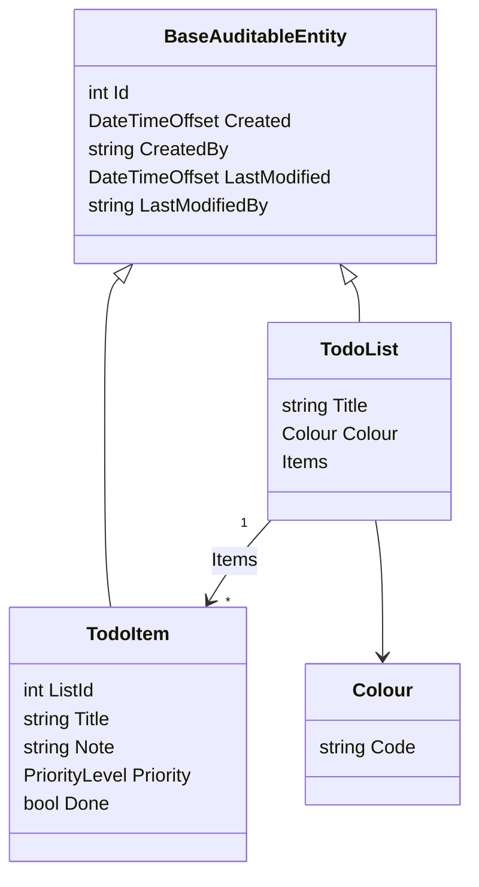
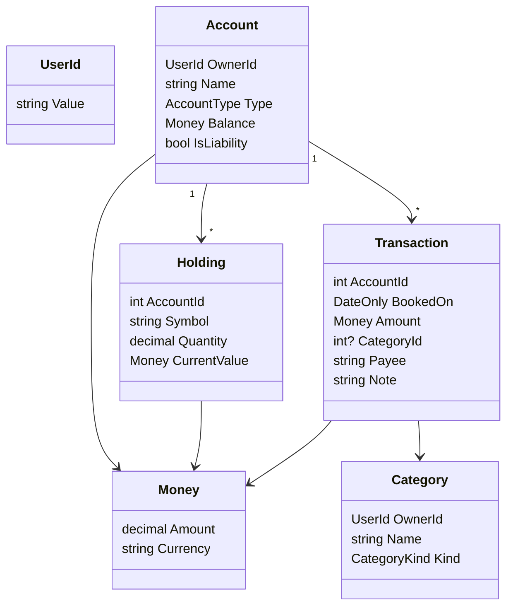

# Domain model

Ubiquitous language and object model for MyWealth. This file owns **concepts**. Column-level detail lives in [database design](database-design.md).

## 1. Language

| Term | Meaning | Not |
| --- | --- | --- |
| Account | A container of value the user tracks (bank, cash, credit, brokerage, property, …) | An ASP.NET Identity user account (call that **User**) |
| Holding | A position inside an investment account (symbol / name + quantity + value) | A cash transaction |
| Transaction | A dated money movement or trade | An EF `SaveChanges` |
| Category | A label on a transaction (income, expense, transfer, …) | An account type |
| Net worth | Assets − liabilities at a point in time | Account balance alone |
| Money | An amount + currency | A raw `decimal` with no currency |
| User | The authenticated Identity principal | | 

Add a row here the first time a new term appears in a feature spec.

## 2. Modelling rules

These match the current Domain project. Change them only with an ADR.

- Entities inherit `BaseEntity` (`int Id` + domain event list) or `BaseAuditableEntity` (adds created/modified).
- Value objects inherit `ValueObject` and compare by components (see `Colour`).
- Domain events inherit `BaseEvent` and are raised on the entity, dispatched by `DispatchDomainEventsInterceptor`.
- Domain has **no** EF, ASP.NET, or MediatR types.
- Invariants live on the entity / value object, not only in FluentValidation.
- Identity user (`ApplicationUser`) stays in Infrastructure. Domain talks about a user **id** (string today), not `ApplicationUser`.

## 3. Current model (starter — replace)

Still the Clean Architecture sample. Remove these types when the first real aggregate lands.



| Type | Kind | File |
| --- | --- | --- |
| `TodoList` | Aggregate root | `src/Domain/Entities/TodoList.cs` |
| `TodoItem` | Entity | `src/Domain/Entities/TodoItem.cs` |
| `Colour` | Value object | `src/Domain/ValueObjects/Colour.cs` |
| `PriorityLevel` | Enum | `src/Domain/Enums/PriorityLevel.cs` |
| `TodoItemCompletedEvent` | Domain event | `src/Domain/Events/TodoItemCompletedEvent.cs` |
| `Roles.Administrator` | Constant | `src/Domain/Constants/Roles.cs` |

`TodoItem.Done` setter raises `TodoItemCompletedEvent` when flipping to true. Handler: `LogTodoItemCompleted`.

## 4. Target model (fill in)

Sketch aggregates here **before** writing EF configurations. The boxes below are examples for a personal-wealth app — delete any you are not building.



### Aggregate catalog

Fill one row per aggregate. Promote the row to a feature spec when you implement it.

| Aggregate root | Entities inside | Value objects | Invariants (short) | Domain events |
| --- | --- | --- | --- | --- |
| _Account_ | Holdings? | Money, AccountType | Name required; currency consistent | AccountOpened, BalanceChanged |
| _Transaction_ | — | Money | Amount ≠ 0; booked date required | TransactionPosted |
| _Category_ | — | CategoryKind | Unique name per user | |
| | | | | |

### Entity / value-object checklist

Copy this block for each new type.

```
### <TypeName>
- Kind: aggregate root | entity | value object | enum | domain event
- Owned by: <aggregate>
- Identity: int (BaseEntity) | none (value object)
- Fields:
  - <name>: <type> — <rule>
- Invariants:
  - ...
- Domain events:
  - ...
- Application use cases:
  - Create / Update / Delete / Get...
- Persistence notes:
  - table, owned type, or lookup
```

## 5. Identity vs domain

| Concept | Lives in | Exposed to Domain as |
| --- | --- | --- |
| Login, password, roles | `Infrastructure/Identity/ApplicationUser` | not referenced |
| "Who is acting" | `IUser` (`src/Application`) | `CreatedBy` / `LastModifiedBy` strings |
| Authorization | `[Authorize]` on requests | not a domain concern |

Do not put `ApplicationUser` navigation properties on domain entities.

## 6. Open questions

- `int` surrogate keys (current `BaseEntity`) or GUID / ULID?
- Should `Money` be a value object or `decimal` + `string` columns?
- Are holdings children of `Account`, or their own aggregate?
- Soft-delete on accounts/transactions?
- How is "current balance" derived — stored on Account, or summed from transactions?

## 7. Changelog

| Date | Change |
| --- | --- |
| 2026-08-16 | Template created; starter Todo model documented |
