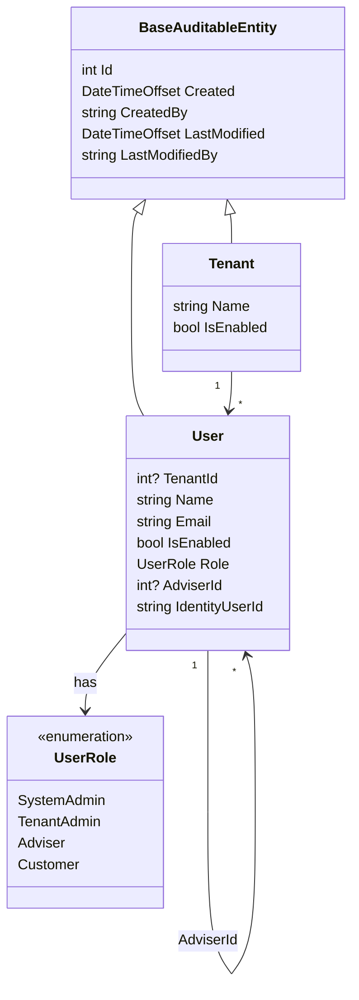
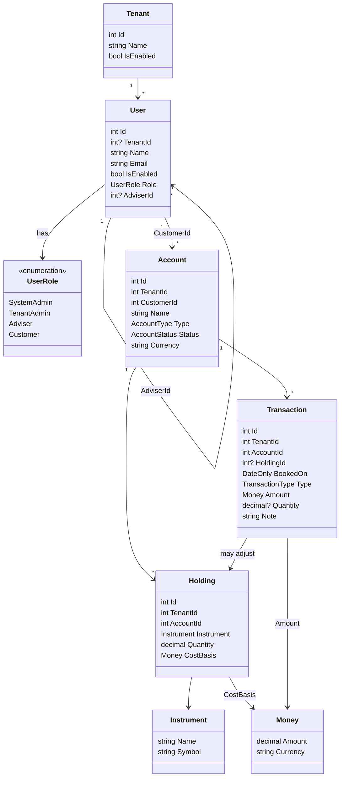

# Domain model

Ubiquitous language and object model for MyWealth. This file owns **concepts**. Column-level detail lives in [database design](database-design.md). Product scope lives in the [function plan](function-plan.md). Shared words live in the [glossary](glossary.md).

This is the target model for MVP. Section 3 is what currently exists in the Domain project. Section 4 is the full target.

## 1. Language

| Term | Meaning | Not |
| --- | --- | --- |
| Client / Tenant / Firm | The SaaS customer of the platform. One firm per tenant. | An end **Customer** who holds accounts |
| User | An authenticated Identity principal that can hold one of four roles: System Admin, Tenant Admin, Adviser, or Customer. All four roles live in the same `User` table. | — |
| System Admin | Platform-wide operator. Not bound to any tenant. Can manage every tenant. | A Tenant Admin |
| Tenant Admin | Highest authority inside one tenant. Manages Advisers and Customers of that tenant. | A System Admin |
| Adviser | Tenant-scoped operator who manages assigned Customers and their Accounts, Holdings, and Transactions. | A Customer |
| Customer | End client of the firm. Holder of Accounts. Must be bound to one Adviser. Lives in the same `User` table with `Role = Customer`. **Cannot log in during MVP.** | A completely separate non-User entity |
| Account | A Customer-owned container of value (bank, cash, brokerage, property, credit, other). | An ASP.NET Identity user account |
| Holding | A position inside an Account (instrument + quantity + cost basis). | A cash transaction |
| Transaction | A dated money movement or trade posted against an Account. | An EF `SaveChanges` |
| Transaction type | Built-in kind of movement: Buy, Sell, Transfer In, Transfer Out, Dividend, Interest. | A user-defined **Category** (out of MVP) |
| Category | A user or system label on a transaction. | An account type. **Out of MVP** |
| Net worth | Assets − liabilities at a point in time. Computed, not stored. | A single Account balance; historical snapshots (out of MVP) |
| Money | Amount + ISO 4217 currency. Never a bare number ([ADR 0004](adr/0004-money-as-decimal-with-currency.md)). | A raw `decimal` with no currency |
| TenantId | Row-level isolation key on every business record ([ADR 0005](adr/0005-shared-database-tenantid-isolation.md)). | The Identity user id |
| Audit log | Append-only record of a key action (who, when, what). | `BaseAuditableEntity` created/modified fields |

Add a row here the first time a new term appears in a feature spec. Prefer the [glossary](glossary.md) wording; if this table and the glossary disagree, update both in the same change.

## 2. Modelling rules

These match the current Domain project plus accepted ADRs. Change them only with an ADR.

- Entities inherit `BaseEntity` (`int Id` + domain event list) or `BaseAuditableEntity` (adds created/modified). Primary key is a database-generated `int` ([ADR 0007](adr/0007-baseentity-primary-key-int.md)).
- Every tenant-scoped business entity carries a `TenantId`. Isolation is enforced by EF global query filters and application checks ([ADR 0005](adr/0005-shared-database-tenantid-isolation.md)). System Admin is the only actor with no tenant binding.
- Value objects inherit `ValueObject` and compare by components (see `Colour` today; `Money` next).
- Monetary fields are a `Money` value object: `decimal` amount + currency code. Persistence precision is a database concern (`decimal(18,4)` or higher per [ADR 0004](adr/0004-money-as-decimal-with-currency.md)).
- Domain events inherit `BaseEvent` and are raised on the entity, dispatched by `DispatchDomainEventsInterceptor`.
- Domain has **no** EF, ASP.NET, or MediatR types.
- Invariants live on the entity / value object, not only in FluentValidation.
- Identity user (`ApplicationUser`) stays in Infrastructure ([ADR 0006](adr/0006-email-password-jwt-authentication.md)). Domain talks about a `UserId` (string Identity id) when it needs to reference the login principal.
- All four roles live in the same `User` entity. Role-specific rules are enforced by domain invariants and application policies.
- **Customer cannot authenticate in MVP.** Login for `Role = Customer` is deliberately disabled at the Identity / Application layer. This keeps the data model ready for a future Customer portal without requiring a schema change.
- Financial writes that must stay consistent (post a Transaction and adjust the related Holding) stay inside the **Account** aggregate.

## 3. Current model

Tenant and User aggregates have landed. Login still lives in Infrastructure (`ApplicationUser`); Domain `User` links to it via `IdentityUserId` (no hard FK).

| Type | Kind | File |
| --- | --- | --- |
| `Tenant` | Aggregate root | `src/Domain/Entities/Tenant.cs` |
| `TenantCreatedEvent` / `TenantEnabledEvent` / `TenantDisabledEvent` | Domain event | `src/Domain/Events/` |
| `User` | Aggregate root | `src/Domain/Entities/User.cs` |
| `UserCreatedEvent` / `UserEnabledEvent` / `UserDisabledEvent` / `CustomerReassignedEvent` | Domain event | `src/Domain/Events/` |
| `UserRole` | Enum | `src/Domain/Enums/UserRole.cs` |
| `Roles.*` | Constants | `src/Domain/Constants/Roles.cs` |

`Tenant.Create` raises `TenantCreatedEvent`. `Enable` / `Disable` raise the matching event only when the flag actually changes.

`User` factories cover all four roles. TenantAdmins are managed via `/tenant-admins` (SystemAdmin). Advisers are managed via `/advisers` (TenantAdmin). Customers are managed via `/customers` (TenantAdmin + Adviser; Advisers only see and assign their own). Creating a TenantAdmin or Adviser also creates an Identity login; creating a Customer does not. `ReassignAdviser` raises `CustomerReassignedEvent` when `AdviserId` changes. An Adviser cannot be disabled while any Customer still references them as `AdviserId`. Disabling the last TenantAdmin of a Tenant is allowed. No event handlers in this slice.

## 4. Target model (MVP)

Ownership chain: **Tenant → User (Adviser) → User (Customer) → Account → (Holding, Transaction)**.

Net worth and the dashboard are **read models**, not aggregates. Audit log is an **append-only application record**, not a rich aggregate.

### 4.1 Roles and visibility

| Role | Identity login in MVP? | Tenant-bound? | Domain data they may change |
| --- | --- | --- | --- |
| System Admin | Yes | No (`TenantId` = null) | Tenants. Can read data across all tenants |
| Tenant Admin | Yes | Yes, exactly one | All Users (Advisers + Customers), Accounts, Holdings and Transactions inside that tenant |
| Adviser | Yes | Yes, exactly one | Only Customers assigned to them, plus those Customers' Accounts, Holdings and Transactions |
| Customer | **No** | Yes (via Adviser) | **None in MVP**. Customer is data managed by Adviser / Tenant Admin. Login is disabled |

Rules:

- A User has exactly one Role at a time.
- `SystemAdmin` must have `TenantId = null` and `AdviserId = null`.
- All other roles must have a non-null `TenantId`.
- A `Customer` must have a non-null `AdviserId` that points to a User with `Role = Adviser` in the same tenant.
- An Adviser cannot be deleted while any Customer still references them — reassign first.
- **Customer authentication is deliberately disabled in MVP.** The same `User` row will be reused when a Customer portal is added later; only the Identity / Application login policy needs to change.

### 4.2 Aggregate catalog

| Aggregate root | Entities inside | Value objects | Key invariants | Domain events |
| --- | --- | --- | --- | --- |
| `Tenant` | — | — | Name required and unique among tenants | `TenantCreated`, `TenantEnabled`, `TenantDisabled` |
| `User` | — | `TenantId` | Role-specific TenantId / AdviserId rules (see 4.1); Name and Email required | `UserCreated`, `UserDisabled`, `CustomerReassigned` |
| `Account` | `Holding`, `Transaction` | `TenantId`, `Money`, `Instrument` | Currency fixed after creation; Closed accounts reject new transactions; Buy/Sell must adjust the related Holding inside the same aggregate | `AccountOpened`, `AccountClosed`, `TransactionPosted`, `HoldingChanged` |

### 4.3 How value is computed

No market-price feed and no historical snapshots in MVP.

| Account type | Liability? | Current value |
| --- | --- | --- |
| Bank, Cash, Other | No | Signed sum of that Account's Transactions |
| Credit | **Yes** | Signed sum of that Account's Transactions (outstanding balance) |
| Brokerage, Property | No | Sum of Holdings' `CostBasis` (stand-in for current value) |

**Net worth** (dashboard) = sum of non-liability account values − sum of liability account values, scoped by the caller's visibility (Tenant Admin: whole tenant; Adviser: assigned Customers only). Closed accounts are excluded.

Asset allocation in MVP is by `AccountType`. A separate asset-class taxonomy is not modelled.

A Transaction is posted on **one** Account. MVP does not create a paired leg on another Account. Moving money between a Bank account and a Brokerage account is two explicit posts (Transfer Out + Transfer In) if both sides are required.

## 5. Type catalog

### Tenant

- Kind: aggregate root
- Owned by: platform (System Admin)
- Identity: `int` (`BaseAuditableEntity`)
- Fields:
  - `Name`: `string` — required
  - `IsEnabled`: `bool` — disabled tenants reject new writes
- Invariants:
  - Name is required and unique
  - System Admin is not a child of Tenant
- Domain events:
  - `TenantCreated`
  - `TenantEnabled`
  - `TenantDisabled`
- Application use cases:
  - Create / rename / enable / disable Tenant (System Admin)
- Persistence notes:
  - Table `Tenants`. Other business tables store `TenantId` → `Tenants.Id`

### User

- Kind: aggregate root
- Owned by: `Tenant` (except System Admin)
- Identity: `int` (`BaseAuditableEntity`)
- Fields:
  - `TenantId`: `int?` — null only for System Admin
  - `Name`: `string` — required
  - `Email`: `string` — required
  - `IsEnabled`: `bool`
  - `Role`: `UserRole` — required
  - `AdviserId`: `int?` — required when `Role == Customer`; must point to an Adviser in the same tenant
- Invariants:
  - Exactly one Role
  - SystemAdmin ⇒ `TenantId` is null and `AdviserId` is null
  - TenantAdmin / Adviser / Customer ⇒ `TenantId` is required
  - Customer ⇒ `AdviserId` is required and the target User has `Role == Adviser` and the same `TenantId`
  - Adviser / TenantAdmin ⇒ `AdviserId` is null
  - A User cannot be deleted while Customers still reference it as Adviser
- Domain events:
  - `UserCreated`
  - `UserDisabled`
  - `CustomerReassigned`
- Application use cases:
  - List / Create / Edit / Enable-Disable / Reassign Adviser (scoped by the caller's role)
  - Creating a User with a login-capable role (SystemAdmin, TenantAdmin, Adviser) also creates the corresponding Identity user in Infrastructure
  - Creating a Customer does **not** enable login in MVP
- Persistence notes:
  - Table `Users`. Indexes on `(TenantId, Role)`, `(AdviserId)`. Email is **globally unique** (case-insensitive; Demo simplification aligned with ASP.NET Identity)

### Account

- Kind: aggregate root
- Owned by: a User with `Role == Customer`
- Identity: `int` (`BaseAuditableEntity`)
- Fields:
  - `TenantId`: `int` — copied from the Customer, required
  - `CustomerId`: `int` — required, must reference a User with `Role == Customer`
  - `Name`: `string` — required
  - `Type`: `AccountType` — required
  - `Status`: `AccountStatus` — required (`Active` or `Closed`)
  - `Currency`: ISO 4217 code — required; **fixed after create** (no automatic FX)
  - `Holdings`: collection of `Holding`
  - `Transactions`: collection of `Transaction`
- Invariants:
  - Currency never changes after creation
  - `Type == Credit` ⇒ the account is treated as a liability for net worth
  - `Status == Closed` ⇒ no new Transactions and no Holding create/edit/delete
  - Every `Money` on child Holdings and Transactions uses this account's currency
  - Delete either cascades Holdings + Transactions or is refused while they exist (feature spec must choose; default: cascade)
- Domain events:
  - `AccountOpened`
  - `AccountClosed`
  - `TransactionPosted`
  - `HoldingChanged`
- Application use cases:
  - List by Customer / Detail (total value, holdings overview, recent transactions) / Create / Edit name·type·status / Delete
- Persistence notes:
  - Table `Accounts`. Index `(TenantId, CustomerId)`
  - Child collections are loaded with the aggregate for writes
  - Transaction **list** queries may read the `Transactions` table directly (read side) without loading the whole Account

### Holding

- Kind: entity (inside `Account`)
- Owned by: `Account`
- Identity: `int`
- Fields:
  - `TenantId`: `int` — copied from Account, required
  - `AccountId`: `int` — required
  - `Instrument`: `Instrument` — name required; symbol optional
  - `Quantity`: `decimal` — ≥ 0
  - `CostBasis`: `Money` — total cost of the current quantity, same currency as Account
- Invariants:
  - Quantity cannot go negative
  - Cost basis currency equals Account currency
  - Prefer keeping a zero-quantity Holding rather than deleting one that has historical Transactions
- Domain events:
  - Raised via the Account (`HoldingChanged`)
- Application use cases:
  - List (on Account detail) / Create / Edit / Delete
  - Also mutated by `Account.Post(Transaction)`
- Persistence notes:
  - Table `Holdings`. FK `AccountId`. Also carries `TenantId` for query filters
  - Cost-basis method (MVP): average cost. Buy adds to Quantity and CostBasis; Sell reduces both proportionally

### Transaction

- Kind: entity (inside `Account`)
- Owned by: `Account`
- Identity: `int`
- Fields:
  - `TenantId`: `int` — required
  - `AccountId`: `int` — required
  - `HoldingId`: `int?` — required for Buy and Sell; omitted for cash-only types
  - `BookedOn`: `DateOnly` — required
  - `Type`: `TransactionType` — required
  - `Amount`: `Money` — required, amount ≠ 0, currency = Account currency
  - `Quantity`: `decimal?` — required for Buy/Sell; must be > 0
  - `Note`: `string?`
- Invariants:
  - Append-only in MVP: no edit and no delete after post
  - Cannot post onto a Closed Account
  - Buy: `HoldingId` + `Quantity` required; increases that Holding's quantity and cost basis by `Amount`
  - Sell: `HoldingId` + `Quantity` required; `Quantity` ≤ Holding.Quantity; decreases quantity and average cost basis
  - Transfer In / Transfer Out / Dividend / Interest: cash-only; do not change Holdings
- Domain events:
  - `TransactionPosted` (raised by Account)
- Application use cases:
  - List (filter by Account, date range, type) / Create
- Persistence notes:
  - Table `Transactions`. Indexes `(TenantId, AccountId, BookedOn)`, `(AccountId, Type)`
  - `TenantId` is stored on the row even though the write goes through the Account aggregate

### Money

- Kind: value object
- Fields:
  - `Amount`: `decimal`
  - `Currency`: `string` — ISO 4217, exactly 3 letters
- Invariants:
  - Currency is required and exactly 3 letters
  - Arithmetic is allowed only when currencies match; otherwise the domain rejects the operation
  - Never persist a monetary amount without its currency
- Persistence notes:
  - EF owned type (two columns). Amount `decimal(18,4)` or higher. Currency `char(3)`

### Instrument

- Kind: value object
- Fields:
  - `Name`: `string` — required
  - `Symbol`: `string?` — optional ticker / code
- Invariants:
  - Name required
- Persistence notes:
  - Owned columns on `Holdings` (no instrument master table in MVP)

### TenantId

- Kind: value object (or simple int wrapper)
- Fields: `int Value` — equals `Tenant.Id`
- Used on every tenant-scoped entity
- Persistence: `int` column, indexed, FK to `Tenants`

### UserRole (enum)

| Value | Meaning |
| --- | --- |
| `SystemAdmin` | Platform operator, no tenant |
| `TenantAdmin` | Full authority inside one tenant |
| `Adviser` | Manages assigned Customers |
| `Customer` | End client who owns Accounts. **No login in MVP** |

### AccountType (enum)

| Value | Meaning | Liability |
| --- | --- | --- |
| `Bank` | Current / savings | No |
| `Cash` | Physical cash | No |
| `Brokerage` | Stocks, funds, ETFs, etc. | No |
| `Property` | Real-estate valuation | No |
| `Credit` | Credit cards, loans | **Yes** |
| `Other` | Fallback | No |

### AccountStatus (enum)

| Value | Meaning |
| --- | --- |
| `Active` | Accepts Holdings and Transactions |
| `Closed` | Visible in history; excluded from current net worth; rejects writes |

### TransactionType (enum)

| Value | Typical effect |
| --- | --- |
| `Buy` | Increase Holding quantity and cost basis |
| `Sell` | Decrease Holding quantity and average cost basis |
| `TransferIn` | Cash-like inflow on this Account |
| `TransferOut` | Cash-like outflow on this Account |
| `Dividend` | Cash-like inflow |
| `Interest` | Cash-like inflow (MVP treats as inflow) |

### Roles (constants)

String names of `UserRole`, used in JWT role claims and `[Authorize(Roles = …)]`. The stored value is the enum, not ASP.NET Identity roles.

| Constant | Who | Login in MVP |
| --- | --- | --- |
| `Roles.SystemAdmin` | Platform operator | Yes |
| `Roles.TenantAdmin` | Tenant operator | Yes |
| `Roles.Adviser` | Tenant adviser | Yes |
| `Roles.Customer` | End customer | **No** |

### AuditEntry (application record, not an aggregate)

- Kind: append-only record written by Application when a key command succeeds
- Fields: `TenantId?` (null for platform-level actions), `UserId`, timestamp, action, subject type/id, summary
- Visibility: Tenant Admin → own tenant; System Admin → all
- Do not put audit writes inside Domain entities; subscribe to domain events or log in the command handler

## 6. Identity vs domain

| Concept | Lives in | Exposed to Domain as |
| --- | --- | --- |
| Login, password, email-as-credential, JWT | `Infrastructure/Identity/ApplicationUser` + custom `/auth` endpoints ([ADR 0006](adr/0006-email-password-jwt-authentication.md), [identity-auth](features/identity-auth.md)) | not referenced directly |
| "Who is acting" | `IUser` (`src/Application`); tenant from JWT claim or header ([ADR 0005](adr/0005-shared-database-tenantid-isolation.md)) | `UserId`, `TenantId`, `CreatedBy` / `LastModifiedBy` |
| Login-capable role | **`ApplicationUser.Role` property/column** (Option B). Not ASP.NET Identity Roles (`AspNetRoles`). JWT Role claim is read from this property. | `Roles.*` constants / `UserRole` enum |
| Person in the firm (any of the four roles) | Domain `User` | `User.Id`, `User.Role`, `User.AdviserId` |
| Customer login | Disabled in MVP by Application / Identity policy (check `ApplicationUser.Role == Customer` → 403) | Will be enabled later for Customer portal without changing the domain model |
| Authorization / data scope | `[Authorize]` + handlers that filter by tenant and (for Advisers) `AdviserId` | not a domain service |
| Profile name / password change | Identity / Application (`/users/me`, `/users/me/password`) | not a domain aggregate |

**Role storage (locked 2026-08-21):** Role is a column on `ApplicationUser`, not an entry in `AspNetRoles` / `AspNetUserRoles`. This matches the domain language (“all four roles live in the same User table”) and avoids a parallel role system. Domain `Users` now carries the same `Role` value. `ApplicationUser` remains the source of truth for authentication claims; Domain `User.IdentityUserId` is the loose link to `AspNetUsers.Id`.

Do not put `ApplicationUser` navigation properties on domain entities. The domain `User` is linked to Identity by a string `UserId` (or by matching Email) when needed.

## 7. Open questions

Decided by existing docs (do not re-open without an ADR or a function-plan change):

- Primary key is `int` identity — [ADR 0007](adr/0007-baseentity-primary-key-int.md)
- `Money` is a value object (`decimal` + currency) — [ADR 0004](adr/0004-money-as-decimal-with-currency.md)
- Isolation is shared database + `TenantId` — [ADR 0005](adr/0005-shared-database-tenantid-isolation.md)
- All four roles live in one `User` entity — this document
- Customer cannot log in during MVP (login policy is disabled for `Role = Customer`)
- Holdings live inside the Account aggregate so a post can adjust quantity and cost basis in one consistency boundary
- Custom transaction categories and net-worth snapshots are out of MVP
- Email uniqueness is **global** (case-insensitive) — Advisers feature / Demo simplification matching Identity

Still open (resolve in a feature spec or a follow-up edit of this file):

- Tenant provisioning UI: seed only, or a System Admin screen?
- May a Tenant Admin change a Customer's Adviser after creation? This model **allows** it so Advisers can be deleted after reassignment.
- Account delete: cascade Holdings and Transactions, or reject until they are removed?
- Is `Interest` ever an outflow (loan interest)? MVP treats it as inflow.
- When Customer portal is introduced, should existing Customer rows automatically receive login capability, or require an explicit “enable portal access” action?
- Glossary still needs a small alignment pass (Customer is one of the four roles living in the User table).
- Email uniqueness is **global** (Demo). Revisit per-tenant uniqueness only with an ADR if login starts requiring tenant context.

## 8. Changelog

| Date | Change |
| --- | --- |
| 2026-08-23 | §3 Customer CRUD shipped via `/customers`. `CustomerReassignedEvent` added. Creating a Customer remains Domain-only (no Identity). |
| 2026-08-23 | §3 current model includes User. Email uniqueness locked as global (Demo). Advisers slice ships Domain User + Identity link via `IdentityUserId`. |
| 2026-08-22 | Replaced §3 Todo sample with Tenant as the current model. Tenant events include `TenantEnabled`. |
| 2026-08-21 | Locked Role storage Option B: Role is a property/column on `ApplicationUser`, not ASP.NET Identity Roles. Updated Identity vs domain section. |
| 2026-08-19 | Finalised single-`User` design with four roles. Customer lives in the same table but authentication is explicitly disabled in MVP to keep the model ready for a future Customer portal. Updated Language, Modelling rules, 4.1, Type catalog and Identity section for consistency. |
| 2026-08-18 | Replaced the placeholder target model with the MVP model from the function plan, glossary, and ADRs 0004–0007 |
| 2026-08-16 | Template created; starter Todo model documented |
